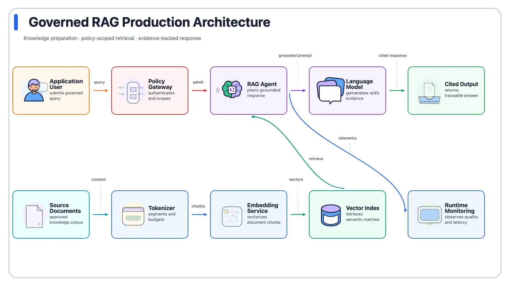
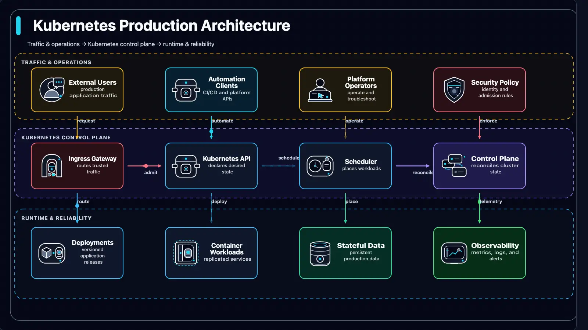
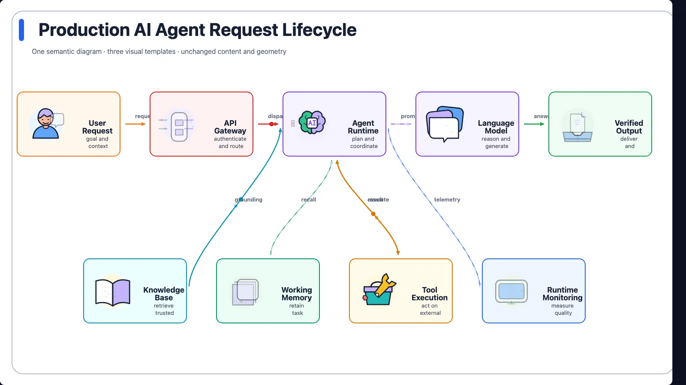
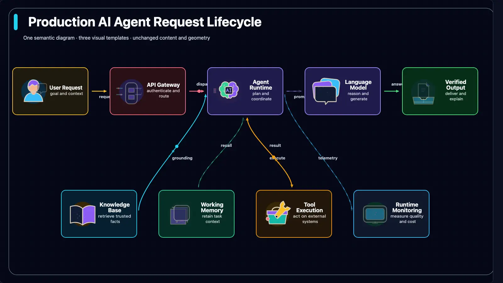
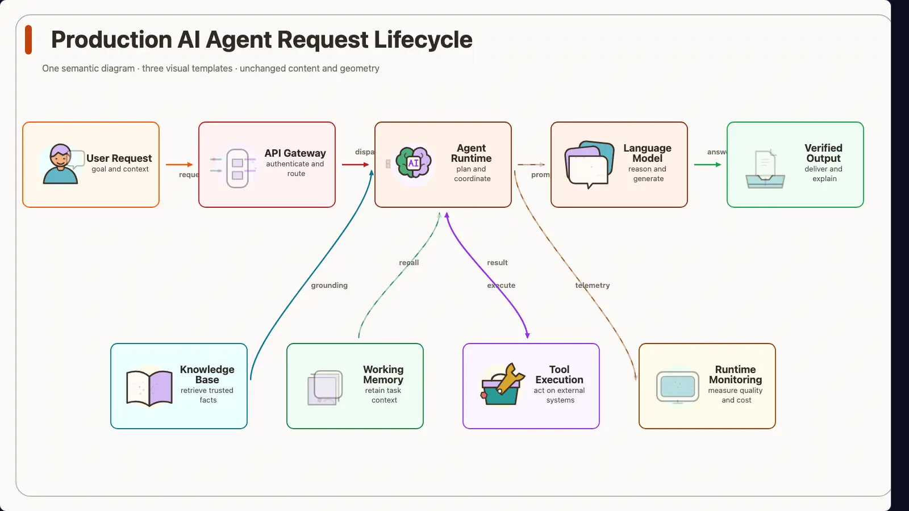
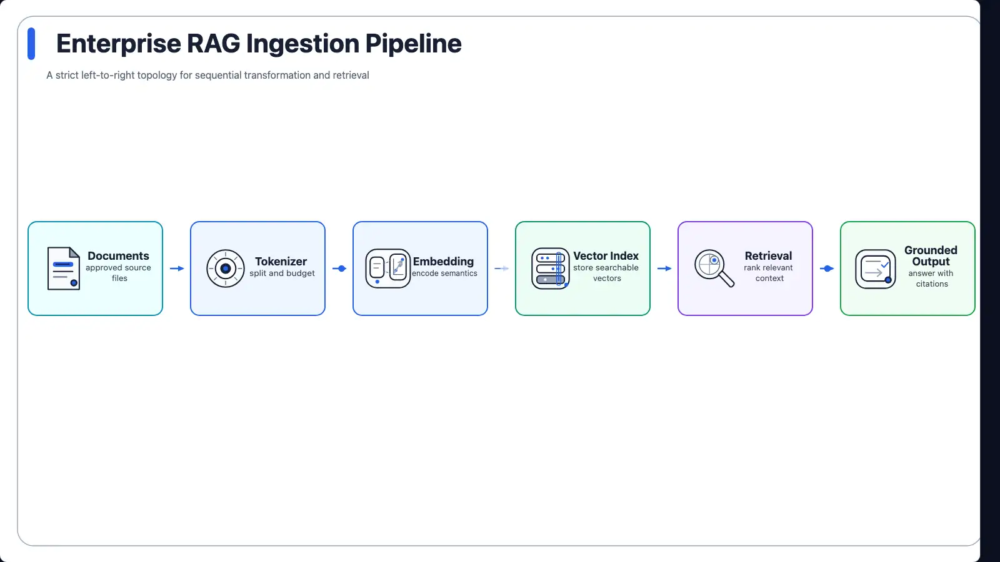
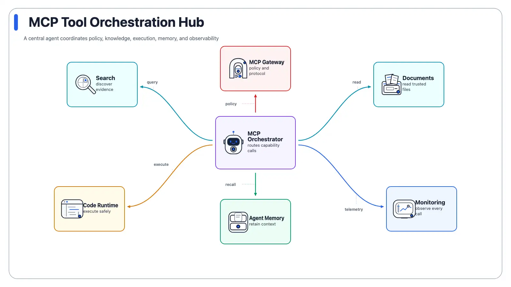

<p align="center">
  
</p>

<p align="center">
  <strong>From natural-language brief to semantic plan, animated runtime, and production-ready exports.</strong>
</p>

<p align="center">
  <code>Python 3.9+</code> · <code>DiagramScript 0.4</code> · <code>16 layouts</code> · <code>13 styles</code> · <code>56 illustrated icons</code> · <code>MIT</code>
</p>

<p align="center">
  English · <a href="./README.zh-CN.md">简体中文</a> ·
  <a href="./gallery/index.html">Gallery</a> ·
  <a href="./docs/diagram-script.md">DiagramScript</a> ·
  <a href="./docs/html-runtime.md">Runtime</a>
</p>

AniDiagram is a renderer and composition pipeline for animated
architecture diagrams. Give it a brief, a semantic `DiagramPlan`, or an authored
`DiagramScript`; it resolves the visual system, validates the scene, and exports
portable SVG, an interactive HTML runtime, or raster and video deliverables.

Current package release: **0.2.0**.

## Contents

- [See AniDiagram in action](#see-anidiagram-in-action)
- [Why AniDiagram](#why-anidiagram)
- [Quick start](#quick-start)
- [How it works](#how-it-works)
- [Inputs and outputs](#inputs-and-outputs)
- [Simplified Chinese output](#simplified-chinese-output)
- [Layouts and styles](#layouts-and-styles)
- [Motion and runtime](#motion-and-runtime)
- [Contracts and compatibility](#contracts-and-compatibility)
- [Development](#development)
- [Documentation](#documentation)

## See AniDiagram in action

The examples below are generated from repository-owned semantic plans and
rendered through the same public pipeline used by the CLI.

### Governed engineering loop


`illustrated` 2.5 · `minimal-light` · `layered-loop` — governance, isolated
execution, verification, and external state arranged as one operating cycle.

| Governed RAG production | Kubernetes production layers |
| --- | --- |
|  |  |
| `illustrated` 2.5 · `minimal-light` | `diagram-core-v1` · `deep-tech` |

<details>
<summary><strong>Compare styles and topology-specific layouts</strong></summary>

The next three diagrams keep semantic content and geometry fixed so only the
visual style changes.

| Minimal Light | Deep Tech | Claude Warm |
| --- | --- | --- |
|  |  |  |

The final two examples show why layout is a semantic choice rather than a skin.

| Sequential transformation | Orchestration hub |
| --- | --- |
|  |  |
| `pipeline` | `hub-spoke` |

</details>

[Open the complete style and layout gallery →](./gallery/index.html)

## Why AniDiagram

| Capability | What it gives you |
| --- | --- |
| **Semantic-first composition** | Meaning lives in entities, relations, groups, and flows. Icon system, style, layout, and motion remain independent presentation axes. |
| **Brief-to-diagram pipeline** | Compile natural language into DiagramPlan v0.2, then into resolved DiagramScript v0.4 with presentation provenance. |
| **Two visual languages** | Use the 56-icon Illustrated 2.5 system for expressive explanation or `diagram-core-v1` for precise technical linework. |
| **Animation with structure** | Animate semantic icon parts, data-flow edges, groups, and titles without moving meaning into renderer-specific code. |
| **English and Chinese** | Detect Chinese briefs automatically, emit `zh-CN` metadata and controls, and use cross-platform CJK font fallbacks. |
| **Export from one source** | Produce SVG, HTML, PNG, GIF, PDF, WebP, MP4, APNG, Lottie, and a machine-readable quality report. |
| **Built-in visual range** | Start from 16 topology-aware layouts and 13 public styles, or author exact node and edge geometry. |
| **Validation as a deliverable** | Check schema correctness, bounds, text fit, overlaps, explicit routes, asset contracts, and browser runtime behavior. |

## Quick start

Clone the repository and install the CLI in editable mode:

```bash
python3 -m pip install -e .
```

Generate an architecture diagram from one sentence:

```bash
anidiagram \
  --text "Show a user request flowing through an API gateway, an AI agent, tools, validation, and a verified output." \
  --outdir outputs/quickstart \
  --basename request-flow \
  --formats svg,html,quality
```

The first successful run writes:

```text
outputs/quickstart/
├── request-flow.svg
├── request-flow.html
└── request-flow.quality.json
```

Preview the HTML runtime locally:

```bash
python3 -m http.server 8765
```

Then open `http://127.0.0.1:8765/outputs/quickstart/request-flow.html`.

For raster and video formats, install the optional dependencies:

```bash
python3 -m pip install -e ".[raster]"
```

## How it works

<p align="center">
  
</p>

1. **Describe meaning** — provide a brief, DiagramPlan, or DiagramScript.
2. **Build stable semantics** — entities, relations, groups, flows, locale, and
   provenance stay renderer-independent.
3. **Resolve presentation** — choose icon system, style, layout, and motion as
   four separate axes.
4. **Compile once** — DiagramScript v0.4 records concrete geometry and resolved
   presentation choices.
5. **Render and verify** — create visual artifacts and a quality report from the
   same scene.

## Inputs and outputs

### Input paths

| Input | Use it when | CLI |
| --- | --- | --- |
| Natural-language brief | You want the shortest path from intent to a diagram | `--text` or `--brief` |
| DiagramPlan v0.2 | You want stable semantics with model- or user-selected presentation | `--plan` |
| DiagramScript v0.4 | You want explicit geometry, effects, and renderer-ready control | `--spec` |
| Built-in preset | You want a known topology as a fast starting point | `--preset` |

### Output formats

| Output | Best for | Notes |
| --- | --- | --- |
| `svg` | Portable documentation and static hosting | Includes lightweight semantic motion fallbacks |
| `html` | Highest-fidelity interactive playback | Motion Manifest + GSAP runtime with localized controls |
| `png`, `pdf` | Documents, reviews, and slide decks | Python renderer by default; browser capture for maximum fidelity |
| `gif`, `webp`, `apng` | Shareable animated previews | Configurable frame rate, quality, and loop blending |
| `mp4` | Video delivery | Requires `ffmpeg` |
| `lottie` | Structured or frame-faithful animation exchange | Renderer-dependent representation |
| `quality` | CI and review evidence | JSON summary for geometry and rendering issues |

Use `--export-renderer browser` when the exported artifact must match the
high-fidelity HTML runtime.

## Simplified Chinese output

Chinese briefs resolve to `zh-CN` automatically. Use
`--diagram-locale zh-CN` when you want to force Chinese generation explicitly:

```bash
anidiagram \
  --text "构建企业级智能体平台架构：请求经过 API 网关进入智能体，读取长期记忆和知识库，调用搜索工具，通过安全校验后输出结果。" \
  --diagram-locale zh-CN \
  --viewer-locale auto \
  --outdir outputs/zh-CN \
  --basename enterprise-agent-platform \
  --formats svg,html,quality
```

The authored example is
[examples/zh-CN/enterprise-agent-platform.plan.json](./examples/zh-CN/enterprise-agent-platform.plan.json).
SVG and HTML outputs declare `lang="zh-CN"`; raster exporters discover an
available CJK font or use `ANIDIAGRAM_CJK_FONT=/absolute/path/to/font.ttf` for
a deterministic build.

## Layouts and styles

### 16 semantic layouts

`pipeline` · `loop` · `hub-spoke` · `layered` · `swimlane` · `compare` ·
`matrix` · `timeline` · `stack` · `funnel` · `sequence` · `er` · `network` ·
`agent-memory` · `agent-loop` · `layered-loop`

Choose by topology: sequential work uses `pipeline`, central coordination uses
`hub-spoke`, tiered systems use `layered`, agent internals use `agent-loop`, and
governed cyclic operations use `layered-loop`.

### 13 public styles

`minimal-light` · `deep-tech` · `blueprint` · `flat-icon` · `dark-terminal` ·
`notion-clean` · `glassmorphism` · `claude-warm` · `openai-minimal` ·
`dark-luxury` · `aurora-orb` · `illustrated-semantic` · `sketch-board`

Browse the [style gallery](./gallery/styles/index.html),
[layout gallery](./gallery/layouts/index.html), or machine-readable
[style catalog](./styles/catalog.json).

## Motion and runtime

New composition-v1 diagrams resolve to `showcase-v1`: eligible illustrated
icons perform their semantic action, data-flow edges remain visibly active,
and reduced-motion users receive a stable rest state. Discrete transfers use a
single `packet-flow` dot; continuous or cyclic relations use `stream-flow`
dashes that move continuously; `comet-flow` is reserved for explicit emphasis.

The HTML runtime supports three viewing modes:

- **Expressive** — full semantic icon performances and active flow coverage.
- **Readable** — reduced visual density while preserving the important actions.
- **Off** — canonical static structure for review or reduced motion.

Review the frozen motion baseline in
[Runtime Motion](./gallery/runtime-motion.html) and compare legacy character
themes in [gallery/character-themes.html](./gallery/character-themes.html).

### Motion Policy

`motion` describes how an element moves; `motion_policy` limits how much motion
may remain active. The composition-v1 default pairs `showcase-v1` with
`motion_policy.profile=unrestricted`, `motion_area=unrestricted`, and
`pulse_mode=all`. Dense explanatory diagrams can select `readable` or `focused`
budgets without changing their semantic graph.

### Node Motion Types

The public node path is `icon-performance`: each supported icon resolves to a
versioned semantic performance with stable SVG part IDs. Illustrated 2.5.0 has
56 approved icons and uses the public `illustrated-performance-v6` contract.
See [HTML runtime](./docs/html-runtime.md) for the complete performance catalog,
rest-pose contract, and reduced-motion behavior.

Edge Motion v1.0.0 is independently versioned and documented in
[docs/edge-motion-v1.md](./docs/edge-motion-v1.md).

## Contracts and compatibility

| Input contract | Default icon system | Default motion |
| --- | --- | --- |
| DiagramPlan v0.2 compiled through `composition-v1` | `illustrated` 2.5.0 | `showcase-v1` |
| Direct DiagramScript v0.4 without `composition_policy` | `diagram-core-v1` | `expressive` when omitted |
| Legacy DiagramScript v0.1–v0.3 | `illustrated-character-v1` | `expressive` when omitted |

The **composition-v1 default** is the stable public `illustrated` ID. Select
`diagram-core-v1` explicitly for the technical line-icon language. Legacy
aliases `illustrated-v1` and `semantic-line-v1` remain explicit compatibility
paths; they are not silently selected for new plans.

Schemas live in [schemas/](./schemas/). The semantic/presentation separation is
defined by [ADR-001](./docs/decisions/ADR-001-separate-semantic-content-from-presentation.md)
and the [composition contract](./docs/diagram-composition-contract.md).

## Development

Run the project gates:

```bash
PYTHONPATH=src python3 -m unittest discover -s tests
PYTHONPATH=src python3 scripts/validate_diagram_core_assets.py --strict --json
node --check runtime/anidiagram-runtime.js
```

Regenerate the full gallery:

```bash
python3 -m pip install -e ".[raster]"
PYTHONPATH=src python3 scripts/build_showcase.py --quality
```

The curated README previews are committed animated WebP assets. Re-record
them only when intentionally updating the frozen capture contract:

```bash
PYTHONPATH=src python3 scripts/render_readme_showcase_round_1.py \
  --spec-root examples/readme-showcase-round-1 \
  --outdir gallery/readme-showcase
PYTHONPATH=src python3 scripts/check_asset_budget.py
```

## Documentation

- [DiagramScript reference](./docs/diagram-script.md)
- [Prompt → DiagramPlan → DiagramScript](./docs/prompt-to-diagram-flow.md)
- [Composition contract](./docs/diagram-composition-contract.md)
- [HTML runtime and motion modes](./docs/html-runtime.md)
- [Icon-system release status](./docs/icon-system-release-status.md)
- [Illustrated 2.5 expansion](./docs/illustrated-2.5-full-expansion.md)
- [Runtime motion roadmap](./docs/runtime-motion-roadmap.md)
- [Release evidence](./docs/release-evidence.md)

## License

[MIT](./LICENSE)
