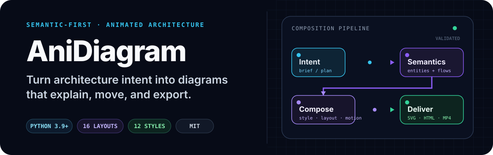
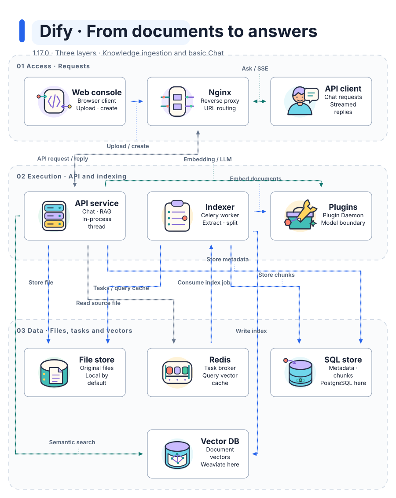
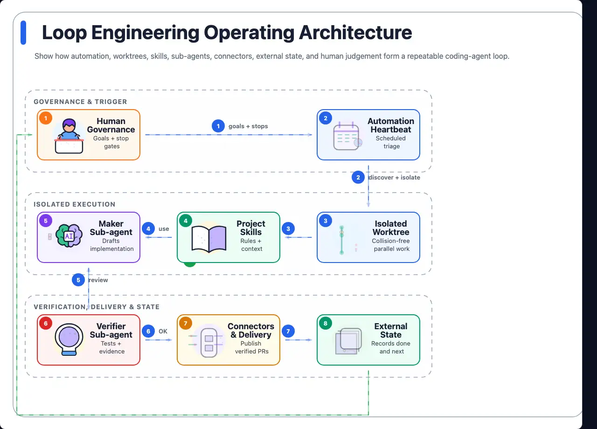
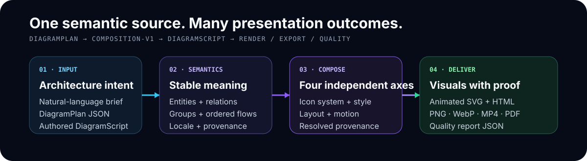

<p align="center">
  
</p>

<p align="center">
  <a href="https://coolbat.github.io/anidiagram/gallery/"><strong>Live Gallery</strong></a> ·
  <a href="#quick-start">Quick start</a> ·
  <a href="https://github.com/coolbat/anidiagram/releases/tag/v0.2.0">v0.2.0</a> ·
  <a href="./README.zh-CN.md">简体中文</a>
</p>

AniDiagram turns a natural-language architecture brief into an animated,
validated diagram that can ship as SVG, interactive HTML, images, video, or a
machine-readable quality report. It is built for platform engineers, technical
authors, and teams that need more control than a lightweight text diagram but
less manual work than a design or video tool.

**Core contract:** `DiagramPlan 0.2` → `DiagramScript 0.4` → `SVG / HTML / quality`

## See it in action

Dify: **from documents to answers**. Follow document ingestion and basic Chat
across three logical layers: access, execution, and data. The diagram separates
Celery indexing from the chat thread inside the API process.

[](https://coolbat.github.io/anidiagram/gallery/cases/dify/index.en.html)

**[Explore the bilingual case →](https://coolbat.github.io/anidiagram/gallery/cases/dify/index.en.html)** ·
[Interactive diagram](https://coolbat.github.io/anidiagram/gallery/cases/dify/dify-en.html) ·
[Source evidence & reproduction](./examples/readme-showcase-v2/dify/evidence.en.md) ·
[Plan](./gallery/cases/dify/dify-en.plan.json) ·
[Fact-check report](./gallery/cases/dify/accuracy.en.json)

Pinned to Dify **1.17.0**, commit `09a855d`; this is a scoped source-reading
draft, not the whole platform or an official Dify diagram. Independent semantic
review is pending; Dify and real model calls have not been run. Verified source
references and rendering checks are not proof of architecture accuracy.

The full gallery contains the two public icon systems, 16 semantic layouts,
13 styles, runtime motion proofs, and copyable CLI commands:
**[open the live Gallery →](https://coolbat.github.io/anidiagram/gallery/)**

<details>
<summary><strong>Explore more generated proofs</strong></summary>

Earlier conceptual showcase: the governed engineering loop.



[Plan](./examples/loop-engineering-minimal-light.plan.json) ·
[DiagramScript](./examples/readme-showcase-round-1/hero-loop-engineering.diagram.json) ·
[Live HTML](https://coolbat.github.io/anidiagram/gallery/readme-showcase/hero-loop-engineering.html) ·
[SVG](./gallery/readme-showcase/hero-loop-engineering.svg) ·
[Quality report](./gallery/readme-showcase/hero-loop-engineering.quality.json)

- [Governed RAG production](https://coolbat.github.io/anidiagram/gallery/readme-showcase/hero-governed-rag.html) — illustrated 2.5, minimal-light, layered.
- [Kubernetes production layers](https://coolbat.github.io/anidiagram/gallery/readme-showcase/hero-kubernetes-three-layer.html) — Diagram Core v1, deep-tech, layered.
- [Style comparison](https://coolbat.github.io/anidiagram/gallery/readme-showcase/readme-showcase-round-1.html) — identical semantics rendered in Minimal Light, Deep Tech, and Claude Warm.
- [Layout gallery](https://coolbat.github.io/anidiagram/gallery/layouts/) — choose topology independently from visual style.

</details>

## Quick start

### Agent Skill — let your agent analyze and draw

Install from the project you want to analyze (choose your agent; add `-g` for
user-wide installation):

```bash
npx skills add coolbat/anidiagram --skill anidiagram -a claude-code
# Also supported: -a codex or -a cursor
```

Then ask: **“Use AniDiagram to explain this project's core request flow. Check
source evidence, show unknowns, and generate readable SVG/HTML with an accuracy
report.”** The Skill uses its bundled Python engine; a global CLI install is not
required. Basic output needs Python 3.9+. Browser verification and advanced
exports have optional dependencies, which the Skill checks before use.

See [Skill setup, dependency checks and cross-agent test prompt](./docs/agent-skill.md).
The Skill must be installed as a complete directory, not a standalone SKILL.md.
Source review and rendered readability are separate gates, not an accuracy score.

### CLI — direct commands and automation

Clone the repository, create an isolated environment, and install the CLI:

```bash
git clone https://github.com/coolbat/anidiagram.git
cd anidiagram
python3 -m venv .venv
source .venv/bin/activate
python3 -m pip install -e .
```

Generate your first architecture diagram from one sentence:

```bash
anidiagram \
  --text "Show a user request flowing through an API gateway, an AI agent, tools, validation, and a verified output." \
  --outdir outputs/quickstart \
  --basename request-flow \
  --formats svg,html,quality \
  --deliver
```

The first run writes:

```text
outputs/quickstart/
├── request-flow.svg
├── request-flow.html
├── request-flow.quality.json
└── request-flow.delivery.json
```

Preview the interactive runtime locally:

```bash
python3 -m http.server 8765
```

Open `http://127.0.0.1:8765/outputs/quickstart/request-flow.html`.
Install `.[raster]` when you also need PNG, PDF, GIF, WebP, APNG, MP4, or
Lottie export support.

## Choose the right tool

| Need | Best fit |
| --- | --- |
| A lightweight static diagram authored close to text | Mermaid, D2, or Graphviz |
| Semantic entities and flows, controlled visual systems, animation, multi-format delivery, and quality evidence | **AniDiagram** |
| Frame-level art direction or hand-tuned video editing | A design or video tool |

AniDiagram is a renderer and composition pipeline, not a browser-based
drag-and-drop editor. Choose it when the semantic model and repeatable output
matter more than manual canvas editing.

## Why AniDiagram

| Capability | What it gives you |
| --- | --- |
| **Semantic-first composition** | Meaning stays in entities, relations, groups, and flows while icon system, style, layout, and motion remain independent axes. |
| **Brief-to-diagram pipeline** | Natural language compiles to DiagramPlan v0.2 and then resolved DiagramScript v0.4 with presentation provenance. |
| **Two visual languages** | Use 56 illustrated icons for expressive explanation or `diagram-core-v1` for precise technical linework. |
| **Structured motion** | Animate semantic icon parts and data flows without moving business meaning into renderer-specific code. |
| **English and Chinese** | Detect Chinese briefs automatically, emit `zh-CN` metadata and controls, and use cross-platform CJK font fallbacks. |
| **Validation as output** | Check schema, bounds, text fit, overlaps, routes, asset contracts, and browser runtime behavior. |

## How it works

<p align="center">
  
</p>

1. **Describe meaning** with a brief, DiagramPlan, DiagramScript, or preset.
2. **Build stable semantics** from entities, relations, groups, flows, locale, and provenance.
3. **Resolve presentation** across icon system, style, layout, and motion.
4. **Compile once** into renderer-ready DiagramScript v0.4 geometry.
5. **Render and verify** visual artifacts and quality evidence from the same scene.

## Inputs and outputs

| Input | Use it when | CLI |
| --- | --- | --- |
| Natural-language brief | You want the shortest path from intent to a diagram | `--text` or `--brief` |
| DiagramPlan v0.2 | You want stable semantics with selectable presentation | `--plan` |
| DiagramScript v0.4 | You want explicit geometry, effects, and renderer control | `--spec` |
| Built-in preset | You want a known topology as a starting point | `--preset` |

| Output | Best for |
| --- | --- |
| `svg` | Portable documentation and static hosting |
| `html` | Highest-fidelity interactive playback with localized controls |
| `png`, `pdf` | Documents, reviews, and slide decks |
| `gif`, `webp`, `apng`, `mp4` | Shareable animation and video |
| `lottie` | Structured or frame-faithful animation exchange |
| `quality` | Actionable CI and review evidence with measured repair hints |

Use `--export-renderer browser` when an exported artifact must match the
high-fidelity HTML runtime.

### Atomic delivery

Add `--deliver` for acceptance or release output. AniDiagram reads the source
once, resolves the DiagramScript and style in memory, runs the quality gate,
renders every requested format into a private directory on the target
filesystem, verifies that every exporter wrote a non-empty file, and only then
replaces the public targets. If rendering or replacement fails, existing
last-good artifacts are restored.

Each successful transaction writes `<basename>.delivery.json` with SHA-256 and
byte counts for the exact source bytes, resolved DiagramScript, style, and
every artifact. `--plan-out` and `--spec-out` join the same transaction when
their paths are inside `--outdir`. Quality warnings and advisories are recorded
in the receipt; quality errors block delivery. A failed delivery exits with
code 3 and emits one structured JSON error to stderr.

## Optional verified reading and review

Add `--reader` to a DiagramPlan 0.2 render for node search, authored upstream/downstream
reach, shortest routes, reading links, curated chapters, and SVG/PNG selection cards.
Repository sources can pin Git files and lines for verification with `--repo-root`.
`anidiagram compare old.plan.json new.plan.json --out delta.html` separates semantic,
presentation, and geometry changes; `anidiagram visual-check diagram.html` produces
artifact-bound screenshots and a receipt with human review still pending.

These are opt-in extensions; existing render defaults remain unchanged. See the
[verified reading guide](docs/verified-reading.md) and [runnable examples](examples/verified-reading/).

## Simplified Chinese output

Chinese briefs resolve to `zh-CN` automatically. Use
`--diagram-locale zh-CN` to lock the generated diagram to Chinese explicitly:

```bash
anidiagram \
  --text "构建企业级智能体平台架构：请求经过 API 网关进入智能体，读取长期记忆和知识库，调用搜索工具，通过安全校验后输出结果。" \
  --diagram-locale zh-CN \
  --viewer-locale auto \
  --outdir outputs/zh-CN \
  --basename enterprise-agent-platform \
  --formats svg,html,quality
```

Inspect the authored
[Chinese DiagramPlan](./examples/zh-CN/enterprise-agent-platform.plan.json),
[live Chinese runtime](https://coolbat.github.io/anidiagram/gallery/readme-showcase/enterprise-agent-platform-zh.html),
or [static SVG proof](./assets/readme/enterprise-agent-platform-zh.svg).
Raster exporters discover an available CJK font, or you can set
`ANIDIAGRAM_CJK_FONT=/absolute/path/to/font.ttf` for deterministic builds.

## Visual systems

- **16 layouts:** `pipeline`, `loop`, `hub-spoke`, `layered`, `swimlane`,
  `compare`, `matrix`, `timeline`, `stack`, `funnel`, `sequence`, `er`,
  `network`, `agent-memory`, `agent-loop`, and `layered-loop`.
- **13 styles:** `minimal-light`, `deep-tech`, `blueprint`, `flat-icon`,
  `dark-terminal`, `notion-clean`, `glassmorphism`, `claude-warm`,
  `openai-minimal`, `dark-luxury`, `aurora-orb`, `illustrated-semantic`, and
  `sketch-board`.

Browse the [live style gallery](https://coolbat.github.io/anidiagram/gallery/styles/),
[live layout gallery](https://coolbat.github.io/anidiagram/gallery/layouts/), or
[machine-readable style catalog](./styles/catalog.json).

## Motion and compatibility

The HTML runtime exposes three viewing modes: **Expressive** for full semantic
performances, **Readable** for lower visual density, and **Off** for a canonical
static structure. Discrete transfers use packet motion; continuous or cyclic
relations use continuously moving stream flows. Reduced-motion users receive a
stable rest state.

### Motion Policy

`motion` describes how an element moves; `motion_policy` limits how much motion
may remain active. The composition-v1 default pairs `showcase-v1` with
`motion_policy.profile=unrestricted`, while dense diagrams can select readable
or focused budgets without changing their semantic graph.

### Node Motion Types

The public node path is `icon-performance`. Illustrated 2.5.0 contains 56
approved icons using the versioned `illustrated-performance-v6` contract and
stable SVG part IDs. Review the live
[runtime catalog](https://coolbat.github.io/anidiagram/gallery/runtime-motion.html)
and legacy [character themes](./gallery/character-themes.html).

<details>
<summary><strong>Compatibility contracts</strong></summary>

| Input contract | Default icon system | Default motion |
| --- | --- | --- |
| DiagramPlan v0.2 through `composition-v1` | `illustrated` 2.5.0 | `showcase-v1` |
| Direct DiagramScript v0.4 without `composition_policy` | `diagram-core-v1` | `expressive` when omitted |
| Legacy DiagramScript v0.1–v0.3 | `illustrated-character-v1` | `expressive` when omitted |

The **composition-v1 default** is the stable public `illustrated` ID. Legacy
aliases `illustrated-v1` and `semantic-line-v1` remain explicit compatibility
paths and are not silently selected for new plans.

</details>

## Development

Run the primary project gates:

```bash
PYTHONPATH=src python3 -m unittest discover -s tests
PYTHONPATH=src python3 scripts/validate_diagram_core_assets.py --strict --json
PYTHONPATH=src python3 scripts/check_asset_budget.py
node --check runtime/anidiagram-runtime.js
```

<details>
<summary><strong>Regenerate Gallery and README capture assets</strong></summary>

```bash
python3 -m pip install -e ".[raster]"
PYTHONPATH=src python3 scripts/build_showcase.py --quality
PYTHONPATH=src python3 scripts/render_readme_showcase_round_1.py \
  --spec-root examples/readme-showcase-round-1 \
  --outdir gallery/readme-showcase
```

</details>

## Documentation

- [DiagramScript reference](./docs/diagram-script.md)
- [Prompt → DiagramPlan → DiagramScript](./docs/prompt-to-diagram-flow.md)
- [Composition contract](./docs/diagram-composition-contract.md)
- [HTML runtime and motion modes](./docs/html-runtime.md)
- [Icon-system release status](./docs/icon-system-release-status.md)
- [Runtime motion roadmap](./docs/runtime-motion-roadmap.md)
- [Release evidence](./docs/release-evidence.md)

## License

[MIT](./LICENSE)
