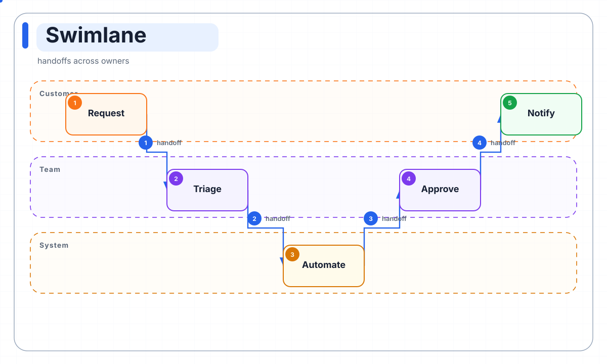

# AniDiagram

Clean-room DiagramScript renderer for animated architecture visuals.

This repository is not a GitHub fork and does not copy source code, documents,
images, generated assets, or repository history from the projects listed in
[REFERENCES.md](./REFERENCES.md).

## Examples

| Pipeline | Agent Memory |
| --- | --- |
|  |  |

| Swimlane | Network |
| --- | --- |
|  |  |

Full gallery: [gallery/index.html](./gallery/index.html)

## What It Does

- Validates DiagramScript `0.1` and `0.2`.
- Compiles JSON specs or presets into a typed Scene IR.
- Renders animated SVG and self-contained HTML viewers.
- Uses richer motion layers: staggered entry, line drawing, flow particles,
  node glow, burst rings, and animated group boundaries.
- Exports optional PNG, GIF, PDF, WebP, MP4, APNG, and Lottie files.
- Produces quality reports for bounds, overlaps, text fit, and explicit paths.
- Includes 14 clean-room preset compilers and 11 visual styles.

SVG, HTML, Lottie, and quality reports use the Python standard library. Raster
and video exports use optional Pillow support; MP4 also needs `ffmpeg`.

## Quick Start

Render a JSON spec:

```bash
PYTHONPATH=src python3 -m anidiagram.cli \
  --spec examples/agent-memory.diagram.json \
  --style styles/blueprint.json \
  --outdir outputs \
  --basename agent-memory \
  --formats svg,html,quality
```

Render a clean-room preset:

```bash
PYTHONPATH=src python3 -m anidiagram.cli \
  --preset agent-memory \
  --outdir outputs \
  --basename agent-memory \
  --all
```

Install optional raster dependencies:

```bash
python3 -m pip install ".[raster]"
```

## CLI Result

Successful runs print structured JSON:

```json
{
  "ok": true,
  "schema": {"name": "DiagramScript", "version": "0.2"},
  "preset": "agent-memory",
  "style": "blueprint",
  "outputs": {
    "svg": {"format": "svg", "path": "/abs/agent-memory.svg", "status": "written"},
    "quality": {"format": "quality", "path": "/abs/agent-memory.quality.json", "status": "written"}
  },
  "stats": {"nodes": 6, "edges": 6, "groups": 2}
}
```

Validation failures are printed on stderr and exit with code `2`.

## DiagramScript

Schema files:

- [schemas/diagram-script-v0.1.schema.json](./schemas/diagram-script-v0.1.schema.json)
- [schemas/diagram-script-v0.2.schema.json](./schemas/diagram-script-v0.2.schema.json)
- [schemas/style-profile-v0.1.schema.json](./schemas/style-profile-v0.1.schema.json)

v0.2 adds route types, step badges, preset metadata, and stricter role
validation. See [docs/diagram-script.md](./docs/diagram-script.md).

## Presets

Built-in clean-room presets:

`pipeline`, `loop`, `hub-spoke`, `layered`, `swimlane`, `compare`, `matrix`,
`timeline`, `stack`, `funnel`, `sequence`, `er`, `network`, `agent-memory`.

List them with:

```bash
PYTHONPATH=src python3 -m anidiagram.cli --list-presets
```

## Styles

Bundled styles:

`minimal-light`, `deep-tech`, `blueprint`, `flat-icon`, `dark-terminal`,
`notion-clean`, `glassmorphism`, `claude-warm`, `openai-minimal`,
`dark-luxury`, `aurora-orb`.

Style catalog: [styles/catalog.json](./styles/catalog.json)

## Gallery

Regenerate the committed gallery assets:

```bash
PYTHONPATH=src python3 scripts/batch_render.py --outdir gallery --quality
```

## Motion Design

The current renderer uses dependency-free SVG/SMIL motion inspired by common
open-source animation patterns: draw-on paths, staggered timelines, flow
particles, glow, and burst rings. Research notes live in
[docs/motion-research.md](./docs/motion-research.md).

## Tests

```bash
PYTHONPATH=src python3 -m unittest discover -s tests
```

## Clean-Room Boundary

The project can reference prior art at the concept level, but its code,
schema, assets, examples, and documentation are authored independently.

If code or assets are ever copied from MIT-licensed references, this project
must add their original license notices before release.
