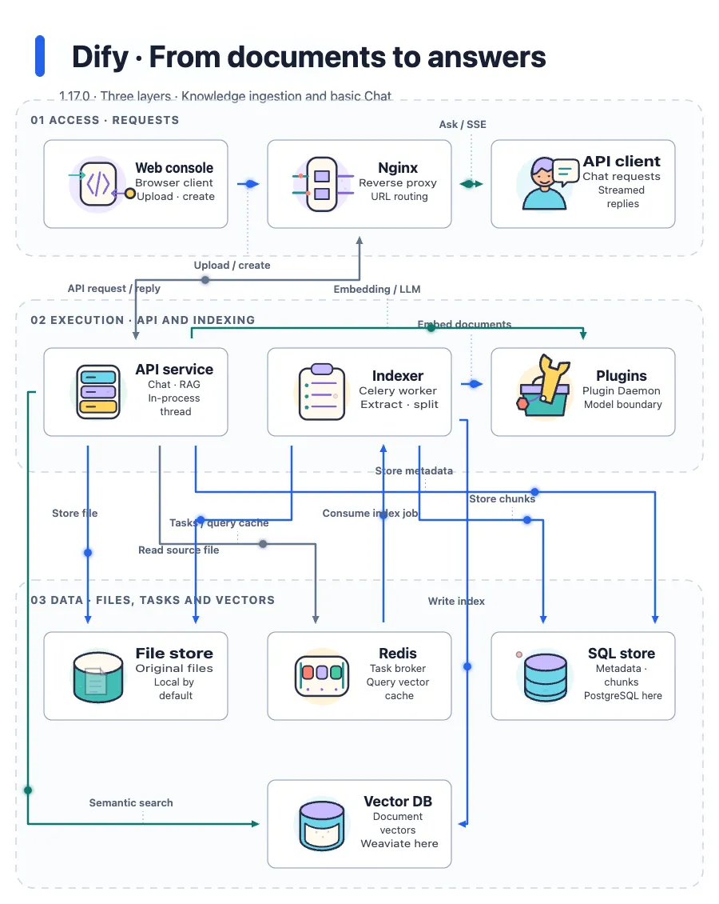
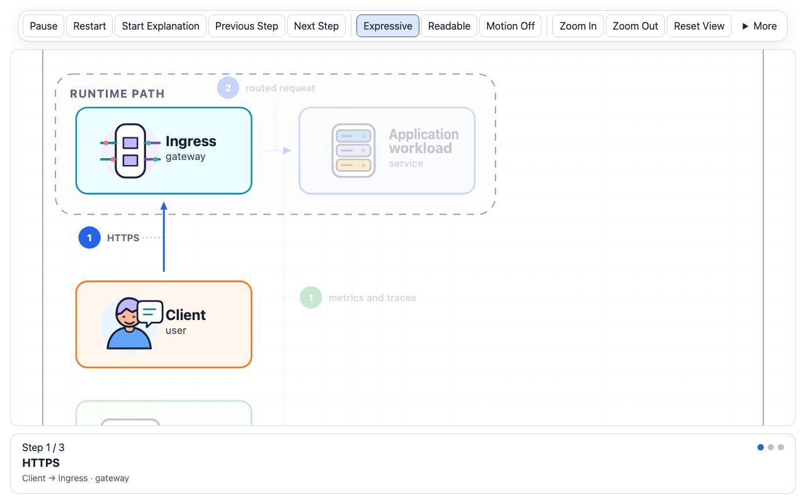

<p align="center">
  
</p>

<p align="center">
  <a href="https://coolbat.github.io/anidiagram/gallery/"><strong>Live Gallery</strong></a> ·
  <a href="#quick-start">Quick start</a> ·
  <a href="#explanation-mode">Explanation mode</a> ·
  <a href="https://github.com/coolbat/anidiagram/releases/tag/v0.2.0">v0.2.0</a> ·
  <a href="./README.zh-CN.md">简体中文</a>
</p>

AniDiagram turns an architecture description into an animated, validated diagram
that explains itself: icons perform their role, data visibly flows along each
relation, and a step-by-step explanation mode walks viewers through the system.
One source renders to SVG, interactive HTML, images, video, and a
machine-readable quality report.

**Core contract:** `DiagramPlan 0.2` → `DiagramScript 0.4` → `SVG / HTML / quality`

## See it in action

Dify: **from documents to answers** — document ingestion and basic Chat across
the access, execution, and data layers.

<a href="https://coolbat.github.io/anidiagram/gallery/cases/dify/index.en.html">
  <picture>
    <source media="(prefers-reduced-motion: reduce)" srcset="./gallery/cases/dify/dify-en-static.svg">
    
  </picture>
</a>

**[Explore the case →](https://coolbat.github.io/anidiagram/gallery/cases/dify/index.en.html)** ·
[Interactive diagram](https://coolbat.github.io/anidiagram/gallery/cases/dify/dify-en.html) ·
[Static SVG](./gallery/cases/dify/dify-en-static.svg) ·
[Source evidence](./examples/readme-showcase-v2/dify/evidence.en.md) ·
[Plan](./gallery/cases/dify/dify-en.plan.json) ·
[Fact-check report](./gallery/cases/dify/accuracy.en.json)

Pinned to Dify **1.17.0** (`09a855d`). A scoped source-reading draft, not an
official Dify diagram; independent semantic review is pending.

<details>
<summary><strong>More generated examples</strong></summary>


[Plan](./examples/loop-engineering-minimal-light.plan.json) ·
[DiagramScript](./examples/readme-showcase-round-1/hero-loop-engineering.diagram.json) ·
[Live HTML](https://coolbat.github.io/anidiagram/gallery/readme-showcase/hero-loop-engineering.html) ·
[SVG](./gallery/readme-showcase/hero-loop-engineering.svg) ·
[Quality report](./gallery/readme-showcase/hero-loop-engineering.quality.json)

- [Governed RAG production](https://coolbat.github.io/anidiagram/gallery/readme-showcase/hero-governed-rag.html) — Illustrated 2.5, minimal-light, layered.
- [Kubernetes production layers](https://coolbat.github.io/anidiagram/gallery/readme-showcase/hero-kubernetes-three-layer.html) — Diagram Core v1, deep-tech, layered.
- [Style comparison](https://coolbat.github.io/anidiagram/gallery/readme-showcase/readme-showcase-round-1.html) — identical semantics in three styles.
- [Full Gallery](https://coolbat.github.io/anidiagram/gallery/) — every icon system, layout, style, and motion proof with copyable commands.

</details>

## Features

| Feature | What you get | How |
| --- | --- | --- |
| **Agent Skill** | Your coding agent reads the source, writes an evidence-backed Plan, and renders it | `npx skills add …` |
| **Brief → diagram** | Explicit English/Chinese relation sentences become a reviewable draft; unparsed text is reported, never invented | `--text`, `--brief` |
| **Explanation mode** | Step-by-step walkthrough with focus, camera, narration card, and keyboard control | `--runtime-mode timeline` / `hybrid` |
| **Living motion** | Icons perform their role; packets, streams, and failures move along relations | default HTML |
| **Event-driven playback** | Arrivals trigger the target's performance and propagate downstream | `--runtime-mode event-driven` |
| **Visual systems** | 56 illustrated icons or precise `diagram-core-v1` linework, 16 layouts, 13 styles | `--style`, Plan `presentation` |
| **Interactive viewer** | Fit-to-screen, zoom/pan, hover highlights neighbors, Expressive / Readable / Off | default HTML |
| **Verified reading** | Search, upstream/downstream, shortest route, chapters, share cards, Git-pinned sources | `--reader`, `--repo-root` |
| **Quality gate** | Overlaps, routes through nodes, label collisions, text fit, brief coverage | `--formats quality` |
| **Atomic delivery** | All-or-nothing artifact replacement with a SHA-256 receipt | `--deliver` |
| **Review tools** | Plan diffs, screenshot receipts, source fact checks | `compare`, `visual-check`, `accuracy-check` |
| **Exports** | SVG, HTML, PNG, PDF, GIF, WebP, APNG, MP4, Lottie | `--formats` |
| **English and Chinese** | Automatic `zh-CN` detection, localized controls, CJK font fallback | `--diagram-locale` |

## Quick start

### Agent Skill — let your agent analyze and draw

Install from the project you want to explain (add `-g` for a user-wide install):

```bash
npx skills add coolbat/anidiagram --skill anidiagram -a claude-code
# Also supported: -a codex or -a cursor
```

Then ask: **"Use AniDiagram to explain this project's core request flow. Check
source evidence, show unknowns, and generate readable SVG/HTML with an accuracy
report."**

The Skill bundles its Python engine (Python 3.9+) and checks optional browser
and export dependencies before use. See [Skill setup](./docs/agent-skill.md).

### CLI

```bash
git clone https://github.com/coolbat/anidiagram.git
cd anidiagram
python3 -m venv .venv && source .venv/bin/activate
python3 -m pip install -e .          # add ".[raster]" for PNG/PDF/GIF/WebP/MP4/Lottie
```

Render your first diagram from an editable Plan:

```bash
anidiagram --plan examples/contracts/production-request-path.plan.json \
  --outdir outputs/quickstart --basename request-flow \
  --formats svg,html,quality --deliver
```

This writes `request-flow.svg`, `request-flow.html`, `request-flow.quality.json`,
and `request-flow.delivery.json`. Preview the interactive HTML:

```bash
python3 -m http.server 8765
# open http://127.0.0.1:8765/outputs/quickstart/request-flow.html
```

`python3 -m anidiagram` works the same way without installing the entry point.

## Usage

### Inputs

| Input | Use it when | CLI |
| --- | --- | --- |
| DiagramPlan v0.2 | Stable semantics with selectable presentation (recommended) | `--plan` |
| Brief | Explicit relation sentences, reviewed as a draft | `--text` or `--brief` |
| DiagramScript v0.4 | Exact geometry, effects, and renderer control | `--spec` |
| Built-in preset | A known topology as a starting point | `--preset` |

A Plan keeps meaning in `semantic` (entities, relations, groups, flows, sources)
and appearance in `presentation` (icon system, style, layout, motion). See
[Prompt → DiagramPlan → DiagramScript](./docs/prompt-to-diagram-flow.md).

### Explanation mode

<a href="./gallery/narration/explanation.mp4">
  
</a>

Explanation mode turns the diagram into a guided walkthrough. Each step follows
one relation: the camera moves to it, everything else dims to 25%, the edge
draws from source to target, and a narration card shows the step number, label,
`source → target`, any condition, and source links.

```bash
# Start directly in the walkthrough
anidiagram --plan examples/contracts/production-request-path.plan.json \
  --runtime-mode timeline --formats html --outdir outputs/explain

# Start with ambient motion; viewers choose "Start Explanation"
anidiagram --plan examples/contracts/production-request-path.plan.json \
  --runtime-mode hybrid --formats html --outdir outputs/explain
```

| Control | Action |
| --- | --- |
| **Start Explanation** / **Previous Step** / **Next Step** | Enter or move through the walkthrough |
| `←` / `→` | Previous / next step (when the stage has focus) |
| Progress dots | Jump to any step |
| `Space` · `R` | Pause/resume · restart |
| `+` / `-` / `0` | Zoom in / out / fit to screen |

Steps follow authored relation order; they explain the diagram, not traced
production events. Reduced-motion and missing-GSAP viewers still get the text
steps without animation. `--runtime-mode event-driven` is the non-narrated
variant: each arrival triggers the target's performance and continues downstream.

### Motion

The HTML viewer has three viewing modes: **Expressive** plays every semantic
performance, **Readable** lowers visual density (suggested automatically for
diagrams with more than 12 nodes), and **Off** shows the canonical static
structure. Discrete transfers use packet motion with a short trail;
asynchronous messages wait before departing; continuous or cyclic relations use
continuously moving stream flows; failures turn red and bounce back. Hovering a
node highlights its neighbors. Reduced-motion users receive a stable rest state.

#### Motion Policy

`motion` describes how an element moves; `motion_policy` limits how much motion
may remain active. The composition-v1 default pairs `showcase-v1` with
`motion_policy.profile=unrestricted`, while dense diagrams can select readable
or focused budgets without changing their semantic graph.

#### Node Motion Types

The public node path is `icon-performance`. Illustrated 2.5.0 contains 56
approved icons using the versioned `illustrated-performance-v6` contract and
stable SVG part IDs. Review the live
[runtime catalog](https://coolbat.github.io/anidiagram/gallery/runtime-motion.html)
and legacy [character themes](./gallery/character-themes.html).

### Briefs

```bash
anidiagram --text "Gateway calls Order service. Order service calls Inventory service and Payment service. Order service through Message queue notifies Shipping service." \
  --outdir outputs/brief --formats svg,html,quality --plan-out outputs/brief/flow.plan.json
```

Every relation keeps its exact source span; unparsed clauses, negations, and
unknown senders appear as warnings instead of invented edges. Save the
`--plan-out` file and edit it for anything the rules could not express.

<details>
<summary><strong>Supported sentence patterns and planners</strong></summary>

- **Requests:** `calls`, `invokes`, `talks to`, `connects to`, `forwards … to`,
  `sends … to`, `routes … to` · 调用、访问、发给、转发给、路由到、`把 … 发给`
- **Reads:** `reads (from)`, `queries`, `fetches from`, `loads from`, `collects` · 读取、查询、采集
- **Writes:** `writes to`, `stores … in`, `persists to`, `saves … to` · 写入、存入、存储到、保存到
- **Messages:** `notifies`, `publishes (to)`, `emits … to`, `pushes … to`,
  `A through X notifies Y` · 通知、发布到、推送到、`通过 X 通知 Y`
- **Routes:** `passes through X to Y`, `places an order through X into Y`,
  `P goes from X to Y` · `经过 X 进入 Y`、`通过 X 访问 Y`
- **Conditions:** `If / When / After … ,` and `On payment success,` · `如果…`、`…成功后`
- `Each service writes to its own database` / `各自数据库` expands per service;
  `Billing` and `billing service` merge; `which` resolves only a single preceding
  object; negated clauses never become edges.

Planners: `--planner auto` (default) tries the rules, then falls back to the
historical agent template only when the brief has no relation grammar.
`--planner rules` never falls back; `--planner template` always uses the
template. `--planner subprocess --planner-command '["python3", "adapter.py"]'`
runs your own LLM or planner adapter: it receives the brief as JSON on stdin and
returns a DiagramPlan v0.2 on stdout (no shell, 30 s default timeout, output
redacted on failure). Coverage ratios are diagnostics, not semantic accuracy.

</details>

### Outputs and delivery

| Output | Best for |
| --- | --- |
| `svg` | Documentation and static hosting; complete without animation |
| `html` | Interactive viewer with motion and explanation mode |
| `png`, `pdf` | Documents, reviews, and slides |
| `gif`, `webp`, `apng`, `mp4` | Shareable animation |
| `lottie` | Animation exchange |
| `quality` | CI and review evidence with repair hints |

- `--export-renderer browser` records animated exports from the HTML runtime for
  full fidelity.
- `--readable-labels` keeps full edge labels clear of nodes and adds a relation table.
- `--runtime-dependency inline --runtime-source node_modules/gsap/dist/gsap.min.js`
  builds offline HTML; the default loads GSAP from a pinned CDN.
- `--deliver` renders everything into a private directory, runs the quality
  gate, and replaces the public files only if all succeed. Quality errors block
  delivery; failures exit with code 3 and restore the last good artifacts.

### Reading and review tools

```bash
anidiagram --plan diagram.plan.json --reader --repo-root ../my-project --formats html
anidiagram compare old.plan.json new.plan.json --out delta.html
anidiagram visual-check diagram.html --outdir outputs/visual-check
anidiagram accuracy-check diagram.plan.json --facts facts.json --repo-root ../my-project --strict
```

`--reader` adds search, upstream/downstream reach, shortest routes, chapters,
deep links, and SVG/PNG share cards. `compare` separates semantic, presentation,
and geometry changes. `visual-check` captures screenshots with a receipt for
human review. `accuracy-check` verifies Git-pinned source references and
required facts; passing it is evidence, not proof of architecture accuracy. See
the [verified reading guide](docs/verified-reading.md) and
[examples](examples/verified-reading/).

### Chinese diagrams

Chinese input resolves to `zh-CN` automatically, including viewer controls.
Lock it with `--diagram-locale zh-CN`:

```bash
anidiagram --plan examples/zh-CN/enterprise-agent-platform.plan.json \
  --diagram-locale zh-CN --runtime-mode hybrid \
  --outdir outputs/zh-CN --formats svg,html,quality
```

Raster exports find an installed CJK font; set
`ANIDIAGRAM_CJK_FONT=/absolute/path/to/font.ttf` for deterministic builds.

### Visual systems

- **16 layouts:** `pipeline`, `loop`, `hub-spoke`, `layered`, `swimlane`,
  `compare`, `matrix`, `timeline`, `stack`, `funnel`, `sequence`, `er`,
  `network`, `agent-memory`, `agent-loop`, `layered-loop`.
- **13 styles:** `minimal-light`, `deep-tech`, `blueprint`, `flat-icon`,
  `dark-terminal`, `notion-clean`, `glassmorphism`, `claude-warm`,
  `openai-minimal`, `dark-luxury`, `aurora-orb`, `illustrated-semantic`,
  `sketch-board`.

Browse the [style gallery](https://coolbat.github.io/anidiagram/gallery/styles/),
[layout gallery](https://coolbat.github.io/anidiagram/gallery/layouts/), or the
[style catalog](./styles/catalog.json).

<details>
<summary><strong>Compatibility contracts</strong></summary>

| Input contract | Default icon system | Default motion |
| --- | --- | --- |
| DiagramPlan v0.2 through `composition-v1` | `illustrated` 2.5.0 | `showcase-v1` |
| Direct DiagramScript v0.4 without `composition_policy` | `diagram-core-v1` | `expressive` when omitted |
| Legacy DiagramScript v0.1–v0.3 | `illustrated-character-v1` | `expressive` when omitted |

The **composition-v1 default** is the stable public `illustrated` ID. Legacy
aliases `illustrated-v1` and `semantic-line-v1` remain explicit compatibility
paths and are not silently selected for new plans.

</details>

## When to use AniDiagram

| Need | Best fit |
| --- | --- |
| A lightweight static diagram authored close to text | Mermaid, D2, or Graphviz |
| Semantic diagrams with motion, guided explanation, multi-format delivery, and quality evidence | **AniDiagram** |
| Frame-level art direction or hand-edited video | A design or video tool |

AniDiagram is a rendering pipeline, not a drag-and-drop editor.

## Development

```bash
PYTHONPATH=src python3 -m unittest discover -s tests
PYTHONPATH=src python3 scripts/validate_diagram_core_assets.py --strict --json
PYTHONPATH=src python3 scripts/check_asset_budget.py
node --check runtime/anidiagram-runtime.js
```

<details>
<summary><strong>Regenerate Gallery and README assets</strong></summary>

```bash
python3 -m pip install -e ".[raster]"
PYTHONPATH=src python3 scripts/build_showcase.py --quality
PYTHONPATH=src python3 scripts/render_readme_showcase_round_1.py \
  --spec-root examples/readme-showcase-round-1 \
  --outdir gallery/readme-showcase
node scripts/build_gallery_narration.mjs     # explanation-mode recording
```

`build_showcase.py --indexes-only` refreshes previews without re-rendering
diagrams. See [gallery previews](./docs/gallery-previews.md).

</details>

## Documentation

- [DiagramScript reference](./docs/diagram-script.md)
- [Prompt → DiagramPlan → DiagramScript](./docs/prompt-to-diagram-flow.md)
- [Composition contract](./docs/diagram-composition-contract.md)
- [HTML runtime, motion, and explanation modes](./docs/html-runtime.md)
- [Verified reading](./docs/verified-reading.md)
- [Icon-system release status](./docs/icon-system-release-status.md)
- [Runtime motion roadmap](./docs/runtime-motion-roadmap.md)
- [Release evidence](./docs/release-evidence.md)

## License

[MIT](./LICENSE)
