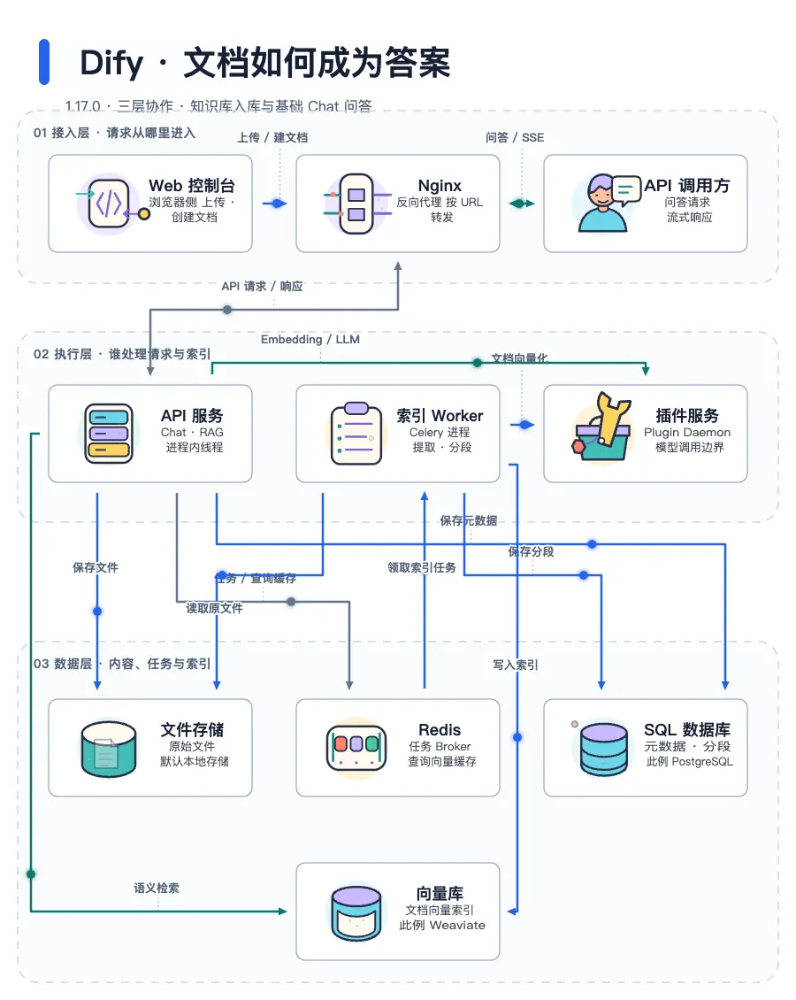

<p align="center">
  
</p>

<p align="center">
  <a href="https://coolbat.github.io/anidiagram/gallery/"><strong>在线 Gallery</strong></a> ·
  <a href="#快速开始">快速开始</a> ·
  <a href="#讲解模式">讲解模式</a> ·
  <a href="https://github.com/coolbat/anidiagram/releases/tag/v0.2.0">v0.2.0</a> ·
  <a href="./README.md">English</a>
</p>

AniDiagram 把架构描述变成会"自己讲解"的动态架构图：图标表演各自的角色，数据沿着
每条关系流动，讲解模式带观众一步步看懂系统。同一份源文件可输出 SVG、可交互 HTML、
图片、视频和机器可读的质量报告。

**核心合约：** `DiagramPlan 0.2` → `DiagramScript 0.4` → `SVG / HTML / quality`

## 先看效果

Dify：**文档如何成为答案** —— 沿文档入库和基础 Chat 两条链路，看接入层、执行层、
数据层如何协作。

<a href="https://coolbat.github.io/anidiagram/gallery/cases/dify/index.html">
  <picture>
    <source media="(prefers-reduced-motion: reduce)" srcset="./gallery/cases/dify/dify-static.svg">
    
  </picture>
</a>

**[打开案例 →](https://coolbat.github.io/anidiagram/gallery/cases/dify/index.html)** ·
[交互架构图](https://coolbat.github.io/anidiagram/gallery/cases/dify/dify.html) ·
[静态 SVG](./gallery/cases/dify/dify-static.svg) ·
[源码依据](./examples/readme-showcase-v2/dify/evidence.md) ·
[DiagramPlan](./gallery/cases/dify/dify.plan.json) ·
[事实核验报告](./gallery/cases/dify/accuracy.json)

固定 Dify **1.17.0**（`09a855d`）。这是限定范围的源码解读稿，不是 Dify 官方架构图；
独立语义复核待完成。

<details>
<summary><strong>更多生成案例</strong></summary>


[DiagramPlan](./examples/zh-CN/enterprise-agent-platform.plan.json) ·
[在线 HTML](https://coolbat.github.io/anidiagram/gallery/readme-showcase/enterprise-agent-platform-zh.html) ·
[SVG](./assets/readme/enterprise-agent-platform-zh.svg)

- [Governed RAG 生产架构](https://coolbat.github.io/anidiagram/gallery/readme-showcase/hero-governed-rag.html) —— Illustrated 2.5、Minimal Light、Layered。
- [Kubernetes 生产分层](https://coolbat.github.io/anidiagram/gallery/readme-showcase/hero-kubernetes-three-layer.html) —— Diagram Core v1、Deep Tech、Layered。
- [风格对照](https://coolbat.github.io/anidiagram/gallery/readme-showcase/readme-showcase-round-1.html) —— 同一语义的三种风格。
- [完整 Gallery](https://coolbat.github.io/anidiagram/gallery/) —— 全部图标系统、布局、风格、动效，附可复制命令。

</details>

## 功能一览

| 功能 | 能做什么 | 怎么开启 |
| --- | --- | --- |
| **Agent Skill** | 让编程 Agent 读源码、写带证据的 Plan 并出图 | `npx skills add …` |
| **简报出图** | 明确的中英文关系句直接生成可复核草稿；解析不了的会标出，不会编造 | `--text`、`--brief` |
| **讲解模式** | 逐步讲解：焦点淡化、镜头跟随、讲解卡片、键盘翻页 | `--runtime-mode timeline` / `hybrid` |
| **语义动效** | 图标表演自身角色；数据包、数据流、失败回弹沿关系运动 | HTML 默认 |
| **事件驱动播放** | 数据到达后触发目标节点表演，并继续向下游传播 | `--runtime-mode event-driven` |
| **视觉系统** | 56 枚插画图标或精确的 `diagram-core-v1` 线框；16 种布局、12 种风格 | `--style`、Plan 的 `presentation` |
| **交互查看器** | 自动适配窗口、缩放平移、悬停高亮相邻节点、Expressive / Readable / Off | HTML 默认 |
| **核验阅读** | 搜索、上下游、最短路径、章节、分享卡、固定 Git 提交的源码引用 | `--reader`、`--repo-root` |
| **质量门禁** | 检查重叠、连线穿节点、标签碰撞、文字溢出、简报覆盖率 | `--formats quality` |
| **原子交付** | 全部成功才替换产物，并生成 SHA-256 回执 | `--deliver` |
| **评审工具** | Plan 差异对比、截图回执、源码事实核验 | `compare`、`visual-check`、`accuracy-check` |
| **多格式导出** | SVG、HTML、PNG、PDF、GIF、WebP、APNG、MP4、Lottie | `--formats` |
| **中英文** | 自动识别中文、中文控件、CJK 字体回退 | `--diagram-locale` |

## 快速开始

### Agent Skill：让 Agent 分析项目并画图

在要讲解的项目里安装（需要用户级安装时加 `-g`）：

```bash
npx skills add coolbat/anidiagram --skill anidiagram -a claude-code
# 也可改为：-a codex 或 -a cursor
```

然后对 Agent 说：**"使用 AniDiagram 分析当前项目的核心请求链路，核验源码依据，
标出未知项，生成可读的 SVG/HTML 和准确性检查报告。"**

Skill 自带 Python 引擎（Python 3.9+），使用前会检查浏览器和导出的可选依赖。
详见 [Skill 安装说明](./docs/agent-skill.md)。

### CLI

```bash
git clone https://github.com/coolbat/anidiagram.git
cd anidiagram
python3 -m venv .venv && source .venv/bin/activate
python3 -m pip install -e .          # 需要 PNG/PDF/GIF/WebP/MP4/Lottie 时安装 ".[raster]"
```

用一份可编辑的 Plan 生成第一张图：

```bash
anidiagram --plan examples/contracts/production-request-path.plan.json \
  --outdir outputs/quickstart --basename request-flow \
  --formats svg,html,quality --deliver
```

会生成 `request-flow.svg`、`request-flow.html`、`request-flow.quality.json` 和
`request-flow.delivery.json`。本地预览交互版：

```bash
python3 -m http.server 8765
# 打开 http://127.0.0.1:8765/outputs/quickstart/request-flow.html
```

未安装命令入口时，也可以用 `python3 -m anidiagram`。

## 使用说明

### 输入方式

| 输入 | 适用场景 | CLI |
| --- | --- | --- |
| DiagramPlan v0.2 | 语义稳定、表现可独立选择（推荐） | `--plan` |
| 简报 | 关系明确的句子，作为草稿复核 | `--text` 或 `--brief` |
| DiagramScript v0.4 | 需要精确几何、动效和渲染控制 | `--spec` |
| 内置 preset | 从已知拓扑起步 | `--preset` |

Plan 的 `semantic` 只放含义（实体、关系、分组、流程、来源），`presentation` 放外观
（图标系统、风格、布局、动效）。详见
[Prompt → DiagramPlan → DiagramScript](./docs/prompt-to-diagram-flow.md)。

### 讲解模式

<a href="./gallery/narration/explanation.mp4">
  
</a>

讲解模式把架构图变成一段可控的讲解。每一步对应一条关系：镜头移到这条关系上，
其余元素淡化到 25%，连线从起点画到终点；底部卡片显示第几步、关系标签、
"起点 → 终点"、条件和源码链接。

```bash
# 打开即进入讲解
anidiagram --plan examples/contracts/production-request-path.plan.json \
  --runtime-mode timeline --formats html --outdir outputs/explain

# 先展示常驻动效，观众点击"开始讲解"后进入
anidiagram --plan examples/contracts/production-request-path.plan.json \
  --runtime-mode hybrid --formats html --outdir outputs/explain
```

| 操作 | 作用 |
| --- | --- |
| **开始讲解** / **上一步** / **下一步** | 进入讲解或翻页 |
| `←` / `→` | 上一步 / 下一步（画布获得焦点时） |
| 进度圆点 | 跳到任意一步 |
| `空格` · `R` | 暂停/继续 · 重新播放 |
| `+` / `-` / `0` | 放大 / 缩小 / 适配窗口 |

步骤顺序按 Plan 中关系的编写顺序，用来讲解架构图，不是真实生产事件的追踪。
开启"减少动态效果"或缺少 GSAP 时，仍可手动查看文字步骤。
`--runtime-mode event-driven` 是不带讲解卡片的版本：数据到达后触发目标节点的表演，
并继续向下游传播。

### 动效

HTML 查看器有三种模式：**Expressive** 播放全部语义动作；**Readable** 降低视觉密度
（节点超过 12 个时会提示使用）；**Off** 显示标准静态结构。离散传输使用带短拖尾的
数据包；异步消息会稍作等待再出发；连续或循环关系使用持续移动的数据流；失败关系变红
并回弹。悬停节点会高亮其相邻节点。开启 reduced-motion 的用户看到稳定的静止状态。

#### 动效预算

`motion` 描述元素如何运动，`motion_policy` 限制可以同时保留多少动效。
composition-v1 默认将 `showcase-v1` 与
`motion_policy.profile=unrestricted` 配对；密集架构图可以选择 readable 或
focused 预算，而不改变语义图。

#### 节点动效

公共节点路径是 `icon-performance`。Illustrated 2.5.0 包含 56 枚已批准图标，
使用版本化 `illustrated-performance-v6` 合约和稳定 SVG part ID。查看
[在线 runtime 目录](https://coolbat.github.io/anidiagram/gallery/runtime-motion.html)
和旧版[角色主题对照](./gallery/character-themes.html)。

### 简报出图

```bash
anidiagram --text "网关调用订单服务；订单服务调用库存服务和支付服务；订单服务通过消息队列通知物流服务。" \
  --outdir outputs/brief --formats svg,html,quality --plan-out outputs/brief/flow.plan.json
```

每条关系都记录原文位置；解析不了的片段、否定句、未指明的发送方会作为警告列出，
不会补成连线。规则表达不了的内容，可以编辑 `--plan-out` 保存的 Plan 补充。

<details>
<summary><strong>支持的句式与规划器</strong></summary>

- **请求：** 调用、访问、发给、发送给、转发给、路由到、`A 把 … 发给 B` ·
  `calls`、`invokes`、`talks to`、`connects to`、`forwards … to`、`sends … to`
- **读取：** 读取、查询、采集 · `reads (from)`、`queries`、`fetches from`、`loads from`
- **写入：** 写入、存入、存储到、保存到 · `writes to`、`stores … in`、`persists to`
- **消息：** 通知、发布到、推送到、`A 通过 X 通知 Y` · `notifies`、`publishes`、`pushes … to`
- **路由：** `A 经过 X 进入 Y`、`A 通过 X 访问 Y` · `passes through X to Y`、`P goes from X to Y`
- **条件：** `如果…`、`…成功后` · `If / When / After …`、`On payment success`
- `各自数据库` / `its own database` 会展开为每个服务各一个数据库；`Billing` 与
  `billing service` 合并为同一实体；英文 `which` 只解析前一句的唯一宾语；
  否定句不会变成连线。

规划器：默认 `--planner auto` 先用规则抽取，只有简报里完全没有关系句式时才回退到
原有的智能体模板。`--planner rules` 从不回退；`--planner template` 始终使用模板。
`--planner subprocess --planner-command '["python3", "adapter.py"]'` 接入你自己的
LLM 或规划器：从 stdin 接收 JSON 格式的简报，在 stdout 返回 DiagramPlan v0.2
（不经过 shell，默认超时 30 秒，失败时不回显输出）。覆盖率只是诊断指标，不代表语义准确率。

</details>

### 输出与交付

| 输出 | 适合场景 |
| --- | --- |
| `svg` | 文档与静态托管；不依赖动画即可完整显示 |
| `html` | 带动效和讲解模式的交互查看器 |
| `png`、`pdf` | 文档、评审、演示 |
| `gif`、`webp`、`apng`、`mp4` | 可分享的动图和视频 |
| `lottie` | 动画交换 |
| `quality` | 带修复建议的 CI / 评审报告 |

- `--export-renderer browser`：从 HTML 运行时录制动画导出，保真度最高。
- `--readable-labels`：完整边标签避开节点，并附关系表。
- `--runtime-dependency inline --runtime-source node_modules/gsap/dist/gsap.min.js`：
  生成可离线使用的 HTML；默认从固定版本的 CDN 加载 GSAP。
- `--deliver`：先在私有目录渲染全部格式并执行质量门禁，全部成功才替换公开文件。
  质量 error 会阻断交付；失败时以状态码 3 退出，并恢复上一版产物。

### 阅读与评审工具

```bash
anidiagram --plan diagram.plan.json --reader --repo-root ../my-project --formats html
anidiagram compare old.plan.json new.plan.json --out delta.html
anidiagram visual-check diagram.html --outdir outputs/visual-check
anidiagram accuracy-check diagram.plan.json --facts facts.json --repo-root ../my-project --strict
```

`--reader` 增加搜索、上下游、最短路径、章节、深链接和 SVG/PNG 分享卡。`compare`
分别报告语义、表现和几何变化。`visual-check` 生成截图和待人工检查的回执。
`accuracy-check` 校验固定 Git 提交的源码引用和必需事实；通过只是证据，不等于架构
准确性得到证明。详见[核验阅读指南](docs/verified-reading.md)和
[示例](examples/verified-reading/)。

### 中文架构图

中文输入会自动识别为 `zh-CN`，控件也随之切换为中文；可用 `--diagram-locale zh-CN`
显式锁定：

```bash
anidiagram --plan examples/zh-CN/enterprise-agent-platform.plan.json \
  --diagram-locale zh-CN --runtime-mode hybrid \
  --outdir outputs/zh-CN --formats svg,html,quality
```

栅格导出会自动寻找本机 CJK 字体，也可设置
`ANIDIAGRAM_CJK_FONT=/absolute/path/to/font.ttf` 固定构建字体。

### 视觉系统

- **16 种布局：** `pipeline`、`loop`、`hub-spoke`、`layered`、`swimlane`、
  `compare`、`matrix`、`timeline`、`stack`、`funnel`、`sequence`、`er`、
  `network`、`agent-memory`、`agent-loop`、`layered-loop`。
- **12 种风格：** `openai-minimal`、`deep-tech`、`blueprint`、`flat-icon`、
  `dark-terminal`、`notion-clean`、`glassmorphism`、`claude-warm`、
  `dark-luxury`、`aurora-orb`、`illustrated-semantic`、`sketch-board`。
  `minimal-light` 已退役，作为 `openai-minimal` 的别名继续可用。

浏览[风格 Gallery](https://coolbat.github.io/anidiagram/gallery/styles/)、
[布局 Gallery](https://coolbat.github.io/anidiagram/gallery/layouts/)或
[风格目录](./styles/catalog.json)。

<details>
<summary><strong>兼容性合约</strong></summary>

| 输入合约 | 默认图标系统 | 默认动效 |
| --- | --- | --- |
| 通过 `composition-v1` 编译的 DiagramPlan v0.2 | `illustrated` 2.5.0 | `showcase-v1` |
| 没有 `composition_policy` 的直接 DiagramScript v0.4 | `diagram-core-v1` | 未指定时为 `expressive` |
| 旧版 DiagramScript v0.1–v0.3 | `illustrated-character-v1` | 未指定时为 `expressive` |

**composition-v1 默认**使用稳定公共 ID `illustrated`。旧别名
`illustrated-v1` 和 `semantic-line-v1` 只作为显式兼容路径保留，不会被新 Plan
静默选中。

</details>

## 什么时候用 AniDiagram

| 需求 | 更合适的工具 |
| --- | --- |
| 用文本快速维护轻量静态关系图 | Mermaid、D2 或 Graphviz |
| 需要语义架构图、动效、逐步讲解、多格式交付和质量证据 | **AniDiagram** |
| 需要逐帧手工控制或精细视频剪辑 | 设计或视频工具 |

AniDiagram 是渲染管线，不是拖拽式编辑器。

## 开发与验证

```bash
PYTHONPATH=src python3 -m unittest discover -s tests
PYTHONPATH=src python3 scripts/validate_diagram_core_assets.py --strict --json
PYTHONPATH=src python3 scripts/check_asset_budget.py
node --check runtime/anidiagram-runtime.js
```

<details>
<summary><strong>重新生成 Gallery 和 README 资产</strong></summary>

```bash
python3 -m pip install -e ".[raster]"
PYTHONPATH=src python3 scripts/build_showcase.py --quality
PYTHONPATH=src python3 scripts/render_readme_showcase_round_1.py \
  --spec-root examples/readme-showcase-round-1 \
  --outdir gallery/readme-showcase
node scripts/build_gallery_narration.mjs     # 讲解模式录屏
```

`build_showcase.py --indexes-only` 只刷新预览、不重新渲染。详见
[预览机制说明](./docs/gallery-previews.md)。

</details>

## 文档导航

- [DiagramScript 参考](./docs/diagram-script.md)
- [Prompt → DiagramPlan → DiagramScript](./docs/prompt-to-diagram-flow.md)
- [语义与表现编排合约](./docs/diagram-composition-contract.md)
- [HTML runtime、动效与讲解模式](./docs/html-runtime.md)
- [核验阅读](./docs/verified-reading.md)
- [图标系统发布状态](./docs/icon-system-release-status.md)
- [Runtime motion 路线图](./docs/runtime-motion-roadmap.md)
- [发布证据](./docs/release-evidence.md)

## 参与贡献

欢迎提交 Issue 和 Pull Request。

- **问题与建议：** 提交 [Issue](https://github.com/coolbat/anidiagram/issues)，
  附上使用的命令、输入的 Plan 或简报，以及截图或 `.quality.json` 报告。
- **Pull Request：** 保持改动聚焦，补充或更新测试，提交前运行
  `PYTHONPATH=src python3 -m unittest discover -s tests`。
  影响渲染结果的改动请一并提交重新生成的资产。
- **新增图标、风格或布局：** 参照 [`styles/`](./styles/) 中的现有目录和
  [图标系统发布状态](./docs/icon-system-release-status.md)。

## License

[MIT](./LICENSE)

## 致谢

AniDiagram 从以下项目中获得了很多启发，在此感谢：

- [fireworks-tech-graph](https://github.com/yizhiyanhua-ai/fireworks-tech-graph)：用自然语言生成生产级 SVG/PNG 技术图。
- [archify](https://github.com/tt-a1i/archify)：以 Agent Skill 的形式把想法、计划和代码库变成可交互的架构图。
- [diagram-design](https://github.com/cathrynlavery/diagram-design)：面向编程 Agent 的编辑级图表设计。

## 联系方式

X：[@coolbat1999](https://x.com/coolbat1999)
