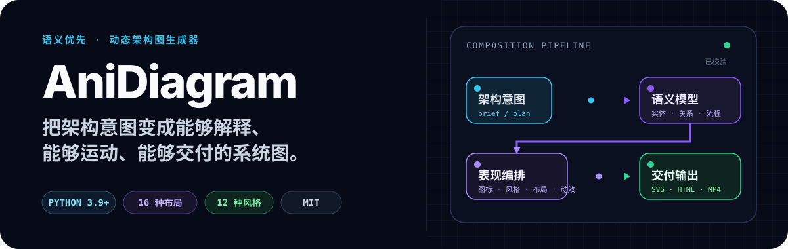
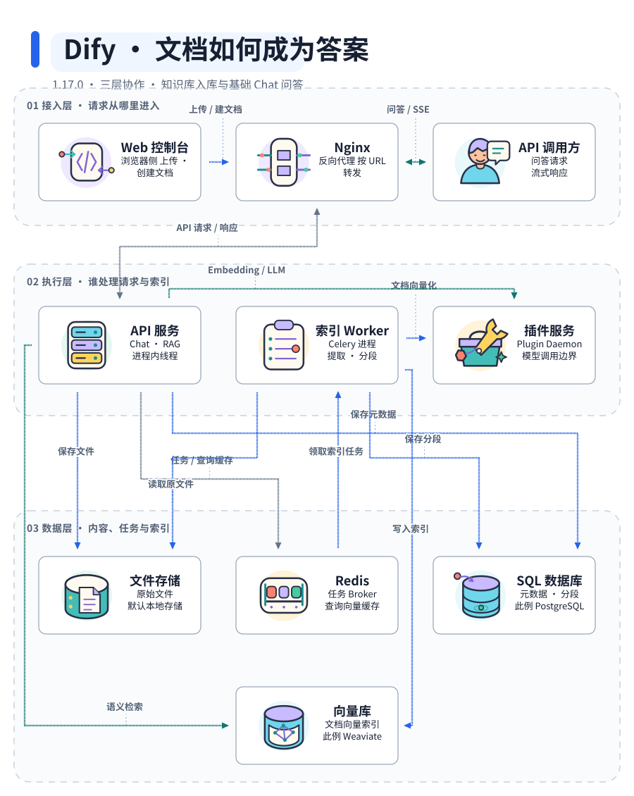
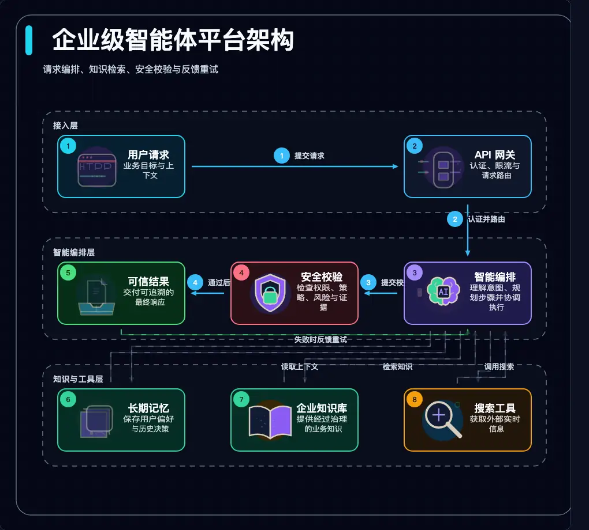
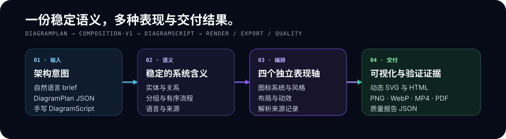

<p align="center">
  
</p>

<p align="center">
  <a href="https://coolbat.github.io/anidiagram/gallery/"><strong>在线 Gallery</strong></a> ·
  <a href="#快速开始">快速开始</a> ·
  <a href="https://github.com/coolbat/anidiagram/releases/tag/v0.2.0">v0.2.0</a> ·
  <a href="./README.md">English</a>
</p>

AniDiagram 可以把一段自然语言架构需求变成经过校验、带有动效、能够直接交付的
架构图，并输出 SVG、可交互 HTML、图片、视频或机器可读质量报告。它适合平台
工程师、技术作者，以及需要比轻量文本图更强控制能力、又不想手工制作整套视觉
稿件的团队。

**核心合约：** `DiagramPlan 0.2` → `DiagramScript 0.4` → `SVG / HTML / quality`

## 先看实际效果

Dify：**文档如何成为答案**。沿着文档入库和基础 Chat 问答两条链路，
看清接入层、执行层和数据层如何协作，区分 Celery 索引任务与 API 进程内的问答线程。

[](https://coolbat.github.io/anidiagram/gallery/cases/dify/index.html)

**[打开中英文案例 →](https://coolbat.github.io/anidiagram/gallery/cases/dify/index.html)** ·
[交互架构图](https://coolbat.github.io/anidiagram/gallery/cases/dify/dify.html) ·
[源码依据与复现](./examples/readme-showcase-v2/dify/evidence.md) ·
[DiagramPlan](./gallery/cases/dify/dify.plan.json) ·
[事实核验报告](./gallery/cases/dify/accuracy.json)

固定 Dify **1.17.0**（提交 `09a855d`），只覆盖选定链路，不代表完整平台，也不是
Dify 官方架构图。当前为源码解读稿，**独立语义复核待完成**；未运行 Dify 或调用
真实模型。源码引用有效、渲染检查通过，不等于架构准确性已经得到证明。

完整 Gallery 包含两套公共图标系统、16 种语义布局、13 种风格、运行时动效证明
和可以直接复制的 CLI 命令：
**[打开在线 Gallery →](https://coolbat.github.io/anidiagram/gallery/)**

<details>
<summary><strong>查看更多生成案例</strong></summary>

此前的概念架构案例：企业级智能体平台。



[DiagramPlan](./examples/zh-CN/enterprise-agent-platform.plan.json) ·
[在线 HTML](https://coolbat.github.io/anidiagram/gallery/readme-showcase/enterprise-agent-platform-zh.html) ·
[SVG](./assets/readme/enterprise-agent-platform-zh.svg)

- [Governed RAG 生产架构](https://coolbat.github.io/anidiagram/gallery/readme-showcase/hero-governed-rag.html) —— 英文案例，Illustrated 2.5、Minimal Light、Layered。
- [Kubernetes 生产分层](https://coolbat.github.io/anidiagram/gallery/readme-showcase/hero-kubernetes-three-layer.html) —— 英文案例，Diagram Core v1、Deep Tech、Layered。
- [风格对照](https://coolbat.github.io/anidiagram/gallery/readme-showcase/readme-showcase-round-1.html) —— 相同语义分别使用 Minimal Light、Deep Tech 和 Claude Warm 渲染。
- [布局 Gallery](https://coolbat.github.io/anidiagram/gallery/layouts/) —— 独立于视觉风格选择合适的拓扑布局。

</details>

## 快速开始

### Agent Skill：让 Agent 分析项目并画图

在你想分析的项目中安装，选择实际使用的 Agent；需要用户级安装时再加 `-g`：

```bash
npx skills add coolbat/anidiagram --skill anidiagram -a claude-code
# 也可改为：-a codex 或 -a cursor
```

然后对 Agent 说：**“使用 AniDiagram 分析当前项目的核心请求链路，核验源码依据，
标出未知项，生成可读的 SVG/HTML 和准确性检查报告。”**

Skill 自带 Python 引擎，无需先全局安装 CLI。基础出图需要 Python 3.9+；
浏览器验收和高级导出的可选依赖会先检查，不会自动安装。
查看 [Skill 安装、依赖检查与跨 Agent 测试提示词](./docs/agent-skill.md)。
必须安装完整 Skill 目录，不能只复制 SKILL.md；源码语义复核与呈现检查分别报告，
不把检查通过等同于“架构准确率 100%”。

### CLI：直接调用或接入自动化

克隆仓库、建立隔离环境并安装 CLI：

```bash
git clone https://github.com/coolbat/anidiagram.git
cd anidiagram
python3 -m venv .venv
source .venv/bin/activate
python3 -m pip install -e .
```

用一句话生成第一张架构图：

```bash
anidiagram \
  --text "展示用户请求经过 API 网关、智能体、工具、安全校验，最终形成可信结果。" \
  --outdir outputs/quickstart \
  --basename request-flow \
  --formats svg,html,quality \
  --deliver
```

第一次运行会生成：

```text
outputs/quickstart/
├── request-flow.svg
├── request-flow.html
├── request-flow.quality.json
└── request-flow.delivery.json
```

本地预览交互式 runtime（运行时）：

```bash
python3 -m http.server 8765
```

打开 `http://127.0.0.1:8765/outputs/quickstart/request-flow.html`。
需要 PNG、PDF、GIF、WebP、APNG、MP4 或 Lottie 时，安装 `.[raster]`。

## 什么时候使用 AniDiagram

| 需求 | 更合适的工具 |
| --- | --- |
| 希望用文本快速维护轻量静态关系图 | Mermaid、D2 或 Graphviz |
| 需要语义实体和流程、可控视觉系统、动态运行时、多格式交付及质量证明 | **AniDiagram** |
| 需要逐帧手工控制或精细视频剪辑 | 设计或视频工具 |

AniDiagram 是语义编排和渲染管线，不是浏览器拖拽式编辑器。当语义模型、可重复
生成和交付质量比手工画布编辑更重要时，AniDiagram 更合适。

## 为什么选择 AniDiagram

| 能力 | 带来的价值 |
| --- | --- |
| **语义优先编排** | 系统含义保存在实体、关系、分组和流程里；图标、风格、布局与动效保持独立。 |
| **从需求直接生成** | 自然语言先编译为 DiagramPlan v0.2，再生成带表现来源记录的 DiagramScript v0.4。 |
| **两套视觉语言** | 56 枚 Illustrated 图标适合生动讲解，`diagram-core-v1` 适合精确技术线框图。 |
| **结构化动效** | 图标部件和数据流能够运动，同时不把业务含义塞进渲染器代码。 |
| **中英文原生支持** | 自动识别中文需求，输出 `zh-CN` 元数据、中文控件和跨平台 CJK 字体回退。 |
| **把校验当成交付物** | 校验 schema、边界、文字适配、重叠、路径、资产合约和浏览器 runtime。 |

## 工作原理

<p align="center">
  
</p>

1. **描述含义** —— 输入自然语言需求、DiagramPlan、DiagramScript 或 preset。
2. **建立稳定语义** —— 整理实体、关系、分组、流程、语言和来源。
3. **解析表现系统** —— 独立选择图标系统、风格、布局和动效。
4. **统一编译** —— 生成包含具体几何信息的 DiagramScript v0.4。
5. **渲染并验证** —— 从同一个 Scene 生成视觉文件和质量证明。

## 输入与输出

| 输入 | 适用场景 | CLI |
| --- | --- | --- |
| 自然语言需求 | 从意图到架构图的最短路径 | `--text` 或 `--brief` |
| DiagramPlan v0.2 | 需要稳定语义和可独立选择的表现系统 | `--plan` |
| DiagramScript v0.4 | 需要精确几何、动效和渲染器控制 | `--spec` |
| 内置 preset | 需要快速使用已知拓扑 | `--preset` |

| 输出 | 适合场景 |
| --- | --- |
| `svg` | 文档与静态托管 |
| `html` | 带本地化控件的最高保真交互播放 |
| `png`, `pdf` | 文档、评审和演示 |
| `gif`, `webp`, `apng`, `mp4` | 可直接分享的动图和视频 |
| `lottie` | 结构化或逐帧动画交换 |
| `quality` | 带测量证据与局部修复建议的 CI / 评审报告 |

当导出结果必须与高保真 HTML runtime 一致时，使用
`--export-renderer browser`。

### 原子交付

验收或发布产物应增加 `--deliver`。AniDiagram 会只读取一次源输入，在内存中解析
DiagramScript 和风格，执行质量门禁，把所有指定格式写入目标文件系统上的私有
目录，确认每个导出器都生成了非空文件，然后才替换公开目标。渲染或替换失败时，
已有 last-good 产物会被恢复。

成功事务会生成 `<basename>.delivery.json`，记录源输入原始字节、已解析
DiagramScript、风格和每个产物的 SHA-256 与字节数。`--plan-out` 和
`--spec-out` 位于 `--outdir` 时也会加入同一个事务。quality warning 和 advisory
会写入回执，但只有 error 会阻断交付。失败时进程以状态码 3 退出，并向 stderr
输出一个结构化 JSON 错误。

## 可选的源码核验与阅读工具

渲染 Plan 0.2 时加入 `--reader`，可启用节点搜索、上游/下游、最短路径、阅读链接、
章节与 SVG／PNG 分享卡。源码来源可固定 Git 提交、文件和行号，通过 `--repo-root`
核验；`anidiagram compare old.plan.json new.plan.json --out delta.html` 分别报告语义、
表现与几何变化，`anidiagram visual-check diagram.html` 生成截图和待人工检查的回执。

新能力均为可选扩展，旧图默认行为不变。详见[使用指南](docs/verified-reading.md)
和[可运行示例](examples/verified-reading/)。

## 生成中文版

默认语言策略是 `auto`：中文需求会自动解析为 `zh-CN`，英文需求输出英文。
需要显式锁定中文版时使用 `--diagram-locale zh-CN`：

```bash
anidiagram \
  --text "构建企业级智能体平台架构：请求经过 API 网关进入智能体，读取长期记忆和知识库，调用搜索工具，通过安全校验后输出结果。" \
  --diagram-locale zh-CN \
  --viewer-locale auto \
  --outdir outputs/zh-CN \
  --basename enterprise-agent-platform \
  --formats svg,html,quality
```

查看完整的[中文 DiagramPlan](./examples/zh-CN/enterprise-agent-platform.plan.json)、
[在线中文 runtime](https://coolbat.github.io/anidiagram/gallery/readme-showcase/enterprise-agent-platform-zh.html)
和 [SVG 静态版本](./assets/readme/enterprise-agent-platform-zh.svg)。栅格导出会寻找
本机可用 CJK 字体，也可以设置
`ANIDIAGRAM_CJK_FONT=/absolute/path/to/font.ttf` 固定构建字体。

## 视觉系统

- **16 种布局：** `pipeline`、`loop`、`hub-spoke`、`layered`、`swimlane`、
  `compare`、`matrix`、`timeline`、`stack`、`funnel`、`sequence`、`er`、
  `network`、`agent-memory`、`agent-loop`、`layered-loop`。
- **13 种风格：** `minimal-light`、`deep-tech`、`blueprint`、`flat-icon`、
  `dark-terminal`、`notion-clean`、`glassmorphism`、`claude-warm`、
  `openai-minimal`、`dark-luxury`、`aurora-orb`、`illustrated-semantic`、
  `sketch-board`。

浏览[在线风格 Gallery](https://coolbat.github.io/anidiagram/gallery/styles/)、
[在线布局 Gallery](https://coolbat.github.io/anidiagram/gallery/layouts/)或
[机器可读风格目录](./styles/catalog.json)。

## 动效与兼容性

HTML runtime 提供三种查看模式：**Expressive** 展示完整语义动作，
**Readable** 降低视觉密度，**Off** 保留标准静态结构。离散传输使用 packet
动效，连续或循环关系使用持续移动的 stream-flow；reduced-motion 用户会获得
稳定静止状态。

### 动效预算

`motion` 描述元素如何运动，`motion_policy` 限制可以同时保留多少动效。
composition-v1 默认将 `showcase-v1` 与
`motion_policy.profile=unrestricted` 配对；密集架构图可以选择 readable 或
focused 预算，而不改变语义图。

### 节点动效

公共节点路径是 `icon-performance`。Illustrated 2.5.0 包含 56 枚已批准图标，
使用版本化 `illustrated-performance-v6` 合约和稳定 SVG part ID。查看
[在线 runtime 目录](https://coolbat.github.io/anidiagram/gallery/runtime-motion.html)
和旧版[角色主题对照](./gallery/character-themes.html)。

<details>
<summary><strong>兼容性合约</strong></summary>

| 输入合约 | 默认图标系统 | 默认动效 |
| --- | --- | --- |
| 通过 `composition-v1` 编译的 DiagramPlan v0.2 | `illustrated` 2.5.0 | `showcase-v1` |
| 没有 `composition_policy` 的直接 DiagramScript v0.4 | `diagram-core-v1` | 未指定时为 `expressive` |
| 旧版 DiagramScript v0.1–v0.3 | `illustrated-character-v1` | 未指定时为 `expressive` |

**composition-v1 默认**使用稳定公共 ID `illustrated`。旧别名
`illustrated-v1` 和 `semantic-line-v1` 只作为显式兼容路径保留，不会被新 Plan
静默选中。

</details>

## 开发与验证

运行主要项目门禁：

```bash
PYTHONPATH=src python3 -m unittest discover -s tests
PYTHONPATH=src python3 scripts/validate_diagram_core_assets.py --strict --json
PYTHONPATH=src python3 scripts/check_asset_budget.py
node --check runtime/anidiagram-runtime.js
```

<details>
<summary><strong>重新生成 Gallery 和 README 捕获资产</strong></summary>

```bash
python3 -m pip install -e ".[raster]"
PYTHONPATH=src python3 scripts/build_showcase.py --quality
PYTHONPATH=src python3 scripts/render_readme_showcase_round_1.py \
  --spec-root examples/readme-showcase-round-1 \
  --outdir gallery/readme-showcase
```

</details>

## 文档导航

- [DiagramScript 参考](./docs/diagram-script.md)
- [Prompt → DiagramPlan → DiagramScript](./docs/prompt-to-diagram-flow.md)
- [语义与表现编排合约](./docs/diagram-composition-contract.md)
- [HTML runtime 与动效模式](./docs/html-runtime.md)
- [图标系统发布状态](./docs/icon-system-release-status.md)
- [Runtime motion 路线图](./docs/runtime-motion-roadmap.md)
- [发布证据](./docs/release-evidence.md)

## License

[MIT](./LICENSE)
